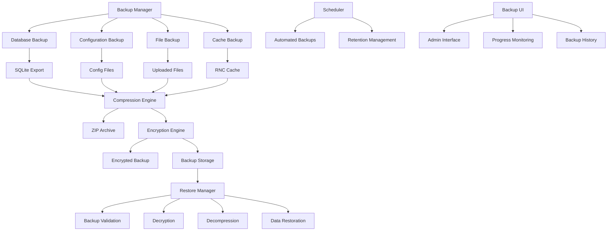
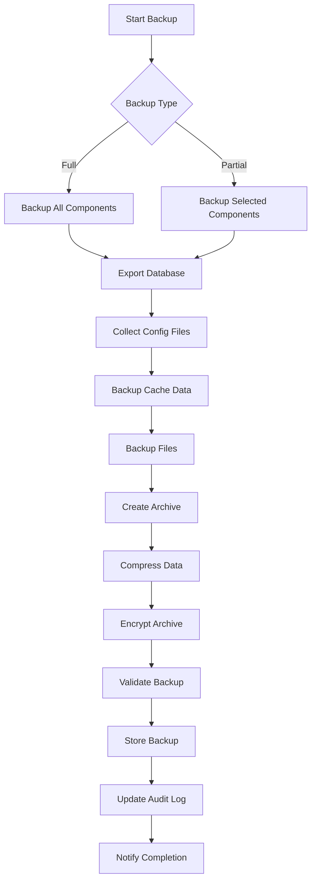
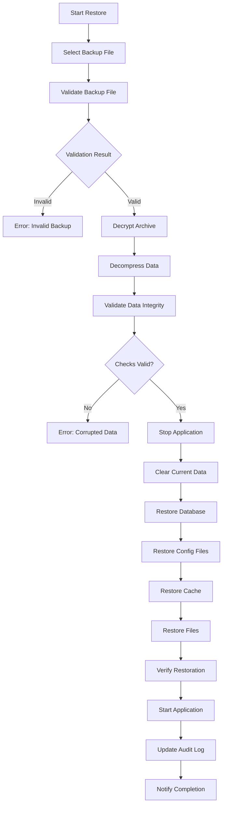

# Backup & Restore Module Design

## Overview

This document outlines the comprehensive backup and restore system for the POS system. The module provides automated and manual backup capabilities with secure storage, compression, encryption, and robust restore functionality.

## Architecture Overview



## Data Architecture

### Backup Components

1. **Database Backup**
   - SQLite database export (all tables)
   - Schema preservation
   - Data integrity validation
   - Transaction consistency

2. **Configuration Backup**
   - Environment variables (.env)
   - Application configuration (email-config.json)
   - Next.js configuration
   - Package.json dependencies

3. **Cache Backup**
   - RNC registry data
   - NCF sequence data
   - System settings
   - Sync status

4. **File System Backup**
   - User uploaded files
   - Generated reports
   - Temporary files
   - Migration files

## Technical Specifications

### Backup Process Flow



### Restore Process Flow



## Implementation Plan

### Phase 1: Core Infrastructure
- [ ] Create backup utility library
- [ ] Implement database backup functionality
- [ ] Add compression and encryption
- [ ] Create backup storage management

### Phase 2: API Implementation
- [ ] Backup API endpoints
- [ ] Restore API endpoints
- [ ] Backup management APIs
- [ ] Progress tracking APIs

### Phase 3: Automated Scheduling
- [ ] Backup scheduler service
- [ ] Retention policy management
- [ ] Automated cleanup
- [ ] Notification system

### Phase 4: User Interface
- [ ] Backup management page
- [ ] Progress monitoring
- [ ] Backup history
- [ ] Restore interface

### Phase 5: Monitoring & Security
- [ ] Backup integrity verification
- [ ] Health monitoring
- [ ] Audit logging
- [ ] Security hardening

## Data Models

### Backup Metadata

```typescript
interface BackupMetadata {
  id: string
  name: string
  type: 'full' | 'partial' | 'incremental'
  size: number
  compressed: boolean
  encrypted: boolean
  checksum: string
  createdAt: Date
  createdBy: string
  components: BackupComponent[]
  retention: {
    keepUntil: Date
    autoDelete: boolean
  }
  status: 'pending' | 'running' | 'completed' | 'failed'
  errorMessage?: string
}

interface BackupComponent {
  name: string
  type: 'database' | 'config' | 'cache' | 'files'
  size: number
  checksum: string
}
```

### Backup Schedule

```typescript
interface BackupSchedule {
  id: string
  name: string
  enabled: boolean
  frequency: 'daily' | 'weekly' | 'monthly'
  time: string // HH:MM format
  dayOfWeek?: number // 0-6 for weekly
  dayOfMonth?: number // 1-31 for monthly
  backupType: 'full' | 'partial'
  components: string[]
  retentionDays: number
  lastRun?: Date
  nextRun: Date
  status: 'active' | 'paused' | 'error'
}
```

## Security Considerations

### Encryption
- AES-256 encryption for backup archives
- Key management system
- Secure key storage
- Encryption key rotation

### Access Control
- Admin-only access to backup/restore
- Authentication required for all operations
- Audit logging for all actions
- IP-based access restrictions

### Data Protection
- Secure deletion of temporary files
- Memory cleanup after operations
- Secure transmission protocols
- Backup file integrity verification

## Storage Strategy

### Local Storage
- Backups stored in `/backups` directory
- Organized by date and type
- Compression to reduce storage space
- Automatic cleanup based on retention policy

### Cloud Storage (Future)
- AWS S3 integration
- Google Cloud Storage
- Azure Blob Storage
- Multi-region redundancy

## Performance Optimization

### Backup Optimization
- Incremental backups for large datasets
- Parallel processing for multiple components
- Compression before encryption
- Streaming for large files

### Restore Optimization
- Partial restore capabilities
- Parallel data restoration
- Transaction rollback support
- Progress tracking and resumption

## Monitoring & Alerting

### Health Checks
- Backup completion status
- Storage space monitoring
- Integrity verification
- Performance metrics

### Notifications
- Email notifications for failures
- Dashboard alerts
- Webhook integrations
- SMS alerts for critical issues

## API Design

### Backup APIs
```
POST /api/backup/create
GET /api/backup/list
GET /api/backup/[id]/download
DELETE /api/backup/[id]
GET /api/backup/[id]/status
```

### Restore APIs
```
POST /api/restore/create
POST /api/restore/[id]/execute
GET /api/restore/[id]/status
GET /api/restore/validate/[id]
```

### Schedule APIs
```
GET /api/backup/schedules
POST /api/backup/schedules
PUT /api/backup/schedules/[id]
DELETE /api/backup/schedules/[id]
```

## Error Handling

### Common Error Scenarios
1. **Insufficient Storage Space**
   - Clean up old backups
   - Alert administrators
   - Pause automatic backups

2. **Database Locked During Backup**
   - Retry mechanism
   - Queue backup operation
   - Notify users of delay

3. **Corrupted Backup File**
   - Validation before storage
   - Quarantine corrupted files
   - Attempt automatic recovery

4. **Restore Failure**
   - Automatic rollback
   - Detailed error reporting
   - Recovery instructions

## Testing Strategy

### Backup Testing
- Full system backup and restore
- Partial backup validation
- Corruption detection
- Performance benchmarking

### Security Testing
- Encryption verification
- Access control testing
- Audit log validation
- Penetration testing

### Recovery Testing
- Disaster recovery scenarios
- Data integrity validation
- Performance under load
- User acceptance testing

## Deployment Considerations

### Prerequisites
- Sufficient disk space (min 10GB)
- SQLite database access
- File system write permissions
- Network connectivity (for cloud storage)

### Environment Setup
- Backup directory creation
- Permission configuration
- Environment variables
- SSL certificate setup

### Rollback Plan
- Previous version preservation
- Database rollback procedures
- Configuration restoration
- Service restart procedures

## Maintenance

### Regular Tasks
- Backup integrity verification
- Storage space cleanup
- Log rotation and archiving
- Performance monitoring

### Updates
- Backup format versioning
- Migration procedures
- Compatibility testing
- Documentation updates

## Compliance & Legal

### Data Protection
- GDPR compliance for EU users
- Data retention policies
- Right to be forgotten
- Data export capabilities

### Audit Requirements
- Complete audit trail
- Access logging
- Change tracking
- Compliance reporting

## Future Enhancements

### Advanced Features
- Real-time backup replication
- Point-in-time recovery
- Cross-platform compatibility
- AI-powered anomaly detection

### Integration
- Third-party backup services
- Monitoring system integration
- Ticketing system integration
- Cloud provider APIs

This design provides a comprehensive foundation for implementing a robust, secure, and scalable backup and restore system for the POS application.